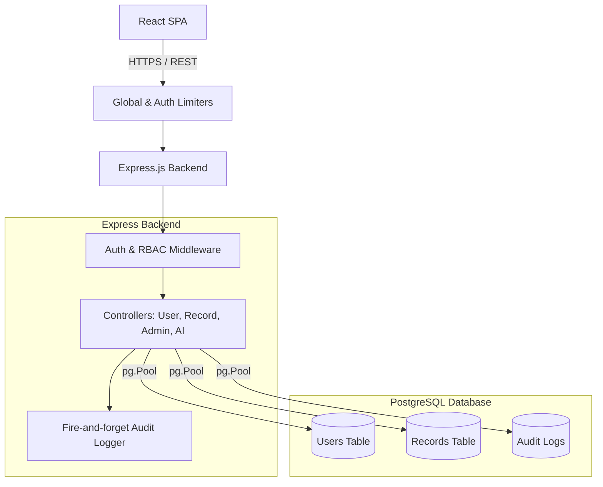

  <h1 align="center">LukWealth</h1>
  

    <strong>Enterprise-grade Financial Tracking with Role-Based Access Control and AI Insights.</strong>
  

---

## 🚀 Project Overview

LukWealth is a production-ready fintech application that provides secure income and expense tracking, immutable audit logging, platform-wide analytics, and AI-driven financial insights. Built to handle concurrency and strictly enforce role hierarchies, it demonstrates enterprise software patterns including Role-Based Access Control (RBAC), stateless authentication, and advanced PostgreSQL optimizations.

## ✨ Features

- **🔐 Strict Role-Based Access Control (RBAC):** `Admin`, `Analyst`, and `User` roles with granular permission levels and a Privacy Guard.
- **🛡️ Immutable Audit Logging:** All critical state changes (approvals, deletions, logins) are asynchronously logged to a tamper-proof audit table.
- **📊 AI Financial Advisor:** Integration with OpenAI for dynamic, personalized 30-day spending insights and SQL-driven anomaly/fraud detection.
- **📦 Containerized Infrastructure:** Fully Dockerized backend, frontend, and PostgreSQL database for environment parity.
- **🔒 Enterprise Security:** Rate Limiting (DDoS protection), cryptographic time-sensitive password resets, and parameterized SQL queries.
- **📈 Advanced Data Grid:** Server-side pagination (`LIMIT`/`OFFSET`), dynamic search filtering, and streaming CSV exports.

## 🏗️ Architecture

## 🛠️ Tech Stack

- **Frontend**: React 18, Vite, Tailwind CSS, Recharts, Lucide React
- **Backend**: Node.js, Express.js, `pg` (node-postgres), JWT, bcryptjs, Nodemailer
- **Database**: PostgreSQL 16
- **DevOps**: Docker, Docker Compose
- **AI**: OpenAI `gpt-3.5-turbo`

## 📁 Folder Structure

\`\`\`
LukWealth/
├── backend/
│   ├── controllers/      # Business logic (users, records, admin, audit, ai)
│   ├── middleware/       # JWT auth, RBAC enforcement, rate limiting
│   ├── migrations/       # SQL DDL schemas
│   ├── routes/           # Express API route definitions
│   ├── utils/            # Audit logger, Email service
│   ├── db.js             # PostgreSQL Connection Pool
│   └── server.js         # Entry point & global middleware
├── frontend/
│   ├── src/
│   │   ├── components/   # Reusable UI (Pagination, AiInsights)
│   │   ├── pages/        # Dashboard, ManageUsers, Auth flows
│   │   └── utils/        # Axios interceptors
│   └── tailwind.config.js
├── docker-compose.yml
└── README.md
\`\`\`

## ⚙️ Installation & Running Locally

### Option 1: Running with Docker (Recommended)

1. Clone the repository.
2. Copy `.env.example` to `.env` in the root directory and fill in your values (PostgreSQL credentials, JWT Secret, Mailtrap, OpenAI Key).
3. Build and run the stack:
   \`\`\`bash
   docker-compose up --build
   \`\`\`
4. Access the frontend at `http://localhost:5173` and the backend at `http://localhost:4000`.

### Option 2: Running Locally (Without Docker)

1. Ensure PostgreSQL is installed and running locally.
2. Initialize the database using the schema in `backend/migrations/001_initial_schema.sql`.
3. Start the backend:
   \`\`\`bash
   cd backend
   npm install
   npm run dev
   \`\`\`
4. Start the frontend:
   \`\`\`bash
   cd frontend
   npm install
   npm run dev
   \`\`\`

## 🔑 Environment Variables

| Variable | Description |
|---|---|
| \`PORT\` | Backend API Port (Default: 4000) |
| \`DB_USER\` | PostgreSQL Username |
| \`DB_PASSWORD\` | PostgreSQL Password |
| \`DB_HOST\` | Database Host (e.g., \`postgres\` or \`localhost\`) |
| \`DB_NAME\` | Database Name |
| \`DB_PORT\` | Database Port (Default: 5432) |
| \`JWT_SECRET\` | Secret for signing JSON Web Tokens |
| \`SMTP_HOST\` | Mail server host (e.g., sandbox.smtp.mailtrap.io) |
| \`SMTP_PORT\` | Mail server port (e.g., 2525) |
| \`SMTP_USER\` | Mail server username |
| \`SMTP_PASS\` | Mail server password |
| \`OPENAI_API_KEY\` | OpenAI API Key (Optional - falls back to mock data if omitted) |

## 🌐 API Overview

- **Auth**: \`POST /users/register\`, \`POST /users/login\`, \`POST /users/forgot-password\`
- **Records**: \`GET /records\`, \`POST /records\`, \`DELETE /records/:id\`
- **Admin**: \`GET /users\`, \`POST /users/approve/:id\`, \`GET /admin/stats\`
- **AI**: \`GET /ai/insights\`, \`GET /ai/fraud-check\`

*(See `API_DOCS.md` for full documentation).*

## 🚀 Future Improvements
- Move JWT storage from `localStorage` to `HttpOnly` cookies to mitigate XSS vulnerabilities.
- Implement a Redis caching layer for the Admin Stats dashboard to prevent heavy COUNT queries during high traffic.
- Introduce Zod or express-validator for strict API request body schema validation.
- Add an automated test suite (Jest/Supertest).
